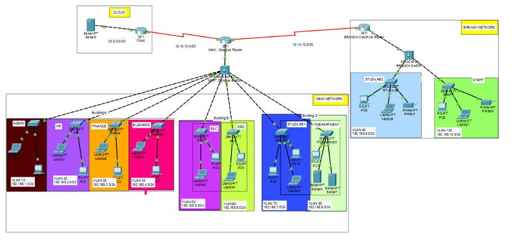

# 🌐 Enterprise University Network Architecture

<p align="center">
  
  
  
</p>

<!-- Project Topology Image Placeholder -->
<p align="center">
  
</p>

## 📌 Project Overview

Designed and simulated as part of collaborative university coursework, this project presents a comprehensive, multi-site enterprise network architecture. Built entirely within Cisco Packet Tracer, the primary objective was to engineer a scalable, secure, and fully functional network that seamlessly connects multiple university facilities and cloud services.

## 🏗️ Architecture & Topology

The network infrastructure is strategically divided into three primary zones, interconnected via robust WAN links to simulate a real-world enterprise environment:
*   **Main Campus Network:** The core hub housing primary administrative and academic departments.
*   **Branch Network:** Remote campus facilities connected securely to the main infrastructure.
*   **Cloud Infrastructure:** Dedicated external services and simulated internet resources.

## ⚙️ Key Features & Implementation

### 1. VLAN Segmentation & Inter-VLAN Routing
Configured end-to-end routing to ensure efficient traffic isolation, broadcast domain reduction, and logical management across diverse university departments:
*   **Segmented Departments:** Admin, HR, Finance, Business, E&C (Electronics & Communications), A&D, Student Labs, IT, and Staff.

### 2. Core Network Services
*   **DHCP Pools:** Implemented dynamic IP allocation across all configured VLANs to ensure scalable and automated end-device management.
*   **DNS Configuration:** Configured centralized Domain Name System services for seamless internal network resolution.

### 3. Network Security & Access Control (ACLs)
*   Engineered and applied Access Control Lists (ACLs) to enforce strict network security policies.
*   Successfully restricted unauthorized access between sensitive departments (e.g., isolating Finance and HR) while maintaining essential, permitted inter-departmental connectivity.

## 🛠️ Tools & Technologies
*   **Simulation Environment:** Cisco Packet Tracer
*   **Core Concepts:** Multi-Site WAN Connectivity, VLANs, Inter-VLAN Routing, DHCP, DNS, Access Control Lists (ACLs).

---

## 🚀 How to Run the Simulation

1. **Clone the repository:**
   ```bash
   git clone [https://github.com/Abdelfattah011/University_Network_Project.git
   ```

2. **Open Cisco Packet Tracer: Ensure you have a compatible version installed.**

3. **Load the Topology: Open the .pkt (Packet Tracer) file included in this repository.**

4. **Network Convergence: Allow a few moments for the switch ports to transition to a forwarding state (green indicators).**

5. Testing:
   - Open the Command Prompt on various end devices (PCs).
   - Verify dynamic IP allocation (ipconfig).
   - Ping across different VLANs to test routing.
   - Attempt to ping restricted departments to verify ACL security blocks.

👨‍💻 Developed by: Abdelfattah Ahmed Abdelfattah


  

   1. **Clone the repository:**
